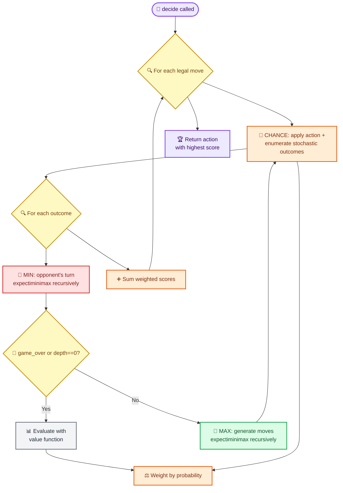

# ExpectiMiniMax Player

_AI player implementing expectiminimax search for TortureCard — ported from deckgym-core_

---

## 📋 Overview

The `ExpectiMiniMaxPlayer` searches a game tree with three node types:

| Node type | Whose turn | Strategy |
| --------- | ---------- | -------- |
| **MAX**   | AI player  | Maximize expected score |
| **MIN**   | Opponent   | Minimize expected score |
| **CHANCE** | Nature     | Probability-weighted average of outcomes |

The search is **depth-limited** (`max_depth`, default 2). At leaf nodes (depth exhausted or game over), a **value function** evaluates the `GameState` from the AI's perspective.

The player plugs into TortureCard's existing `Player` interface: `decide(const GameState&, const std::vector<Action>&) -> Action`.

---

## 🎯 Algorithm



### Turn transitions

Turn-ending actions (`Attack`, `Pass`) advance the game through the full end-of-turn sequence via `advance_turn_in_search`, which mirrors `GameLoop` behavior:

1. Promote KO'd active Pokémon (both sides)
2. Apply status damage (Poison / Burn) and resolve knockouts
3. `advance_phase`: Cleanup → Draw (switches `current_player`, increments turn)
4. Draw one card for the new player
5. `advance_phase`: Draw → Action
6. Generate energy for the new player (turn ≥ 2)

This ensures the opponent's MIN node operates on a properly transitioned state.

Non-turn-ending actions (`AttachEnergy`, `PlayPokemon`, `Evolve`, `PlaySupporter`, `PlayItem`, `PlayTool`, `PlayStadium`, `Retreat`, `UseAbility`) keep `current_player` unchanged after application.

---

## ⚙️ Implementation decisions

### GameState copy (not make/unmake)

The original plan specified a make/unmake pattern to avoid full `GameState` copies. **This was not implemented.** The search copies `GameState` at each CHANCE node instead.

**Rationale:** `GameState` contains deeply nested STL containers (`std::vector`, `std::optional`, `std::array`). Implementing reversible mutations for every field modified by `apply_action` would require a shadow state or undo-log with significant complexity. Copying `GameState` is simpler and C++ move semantics keep it reasonable for shallow search depths (2–3).

### Stochastic outcome enumeration

Only two stochastic sources are modeled as CHANCE branches:

| Source | Branches | Probability |
| ------ | -------- | ----------- |
| `FlipNCoinDamage` / `FlipNCoinExtraDamage` | 2 (representative heads/tails) | `0.5^N` / `1 - 0.5^N` |
| All other actions | 1 (deterministic) | 1.0 |

**Not enumerated:**
- **Card draw:** The deck state is visible at search time; the draw in `advance_turn_in_search` is deterministic.
- **Energy generation:** `GameLoop::generate_energy` runs before `run_action_phase`, so `current_energy` is already set when `decide` is called.
- **Full coin enumeration:** Enumerating all 2^N coin outcomes is exponential. The implementation uses an expected-value approximation with two representative outcomes.

### Search RNG isolation

The search uses a **fixed-seed `std::mt19937`** (`seed = 42`) independent of the game's RNG. This keeps the search deterministic and prevents it from consuming entropy needed by `GameLoop`.

---

## 🔧 Value function

### Interface

```cpp
using ValueFunction = std::function<double(const GameState&, int player)>;
```

Injected at construction time (strategy pattern). Default: `baseline_value_function`.

### Baseline features

The score for player `p` is `features(p) - features(opponent)`:

| Feature | Weight | Rationale |
| ------- | ------ | --------- |
| Prize points scored | 10,000 | Winning is overwhelmingly preferred |
| Active HP ratio | 500 | Prefer a healthy active Pokémon |
| Active can attack | 500 | Prefer being "online" with energy |
| Hand size | 1 | Prefer more cards in hand |
| Deck size | 1 | Prefer more cards remaining |
| Bench count | 10 | Prefer a full bench |
| Total attached energy | 5 | Prefer more energy in play |

### Terminal states

| Condition | Return value |
| --------- | ------------ |
| AI player wins | `+1,000,000.0` |
| Opponent wins | `-1,000,000.0` |
| Draw (`winner == -1`) | `0.0` |

---

## 📊 Debug output

When `write_debug_trees` is `true`, the search tree is serialized to a Graphviz `.dot` file after each `decide` call:

- Directory: `expectiminimax_trees/` (created if missing)
- Filename: `expectiminimax_tree_turn{N}_p{P}_{counter}.dot`
- State nodes: green fill (MAX) / red fill (MIN), showing player, probability, value
- Action nodes: gray ellipse, showing action type and expected value

---

## 🔗 CLI integration

The `sim` command accepts `-player=e` to run both sides with `ExpectiMiniMaxPlayer`:

```
torturecard sim -player=e --depth 2 deck_a.json deck_b.json
```

| Flag | Default | Description |
| ---- | ------- | ----------- |
| `-player=e` | — | Use expectiminimax for both players |
| `--depth N` | 2 | Search depth (must be ≥ 1) |

---

## 📚 References

- Original deckgym-core implementation: `deckgym-core` Rust crate
- Game loop phases: [game_loop.h](/include/ptcgp_sim/game_loop.h)
- State structure: [game_state.h](/include/ptcgp_sim/game_state.h)
- Test coverage: [test_expectiminimax_player.cpp](/tests/test_expectiminimax_player.cpp)